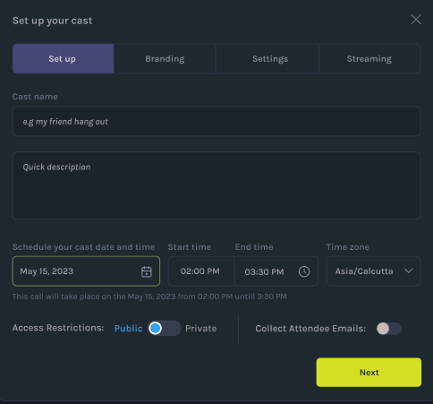
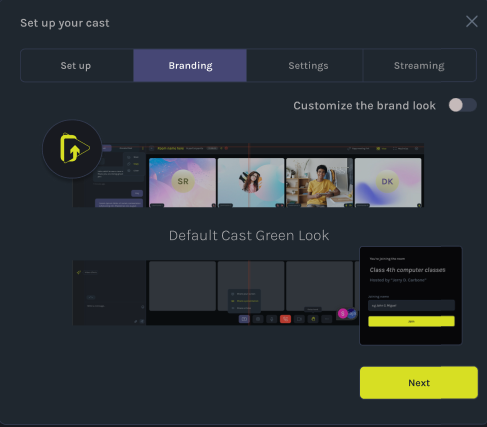
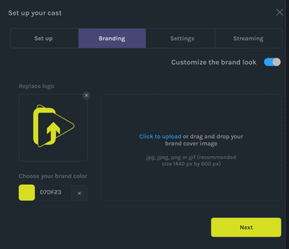
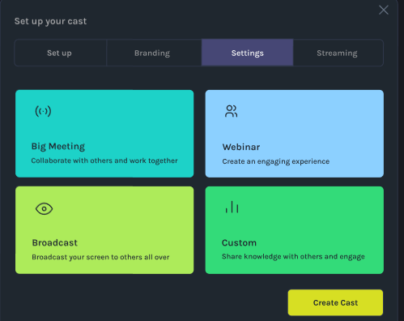
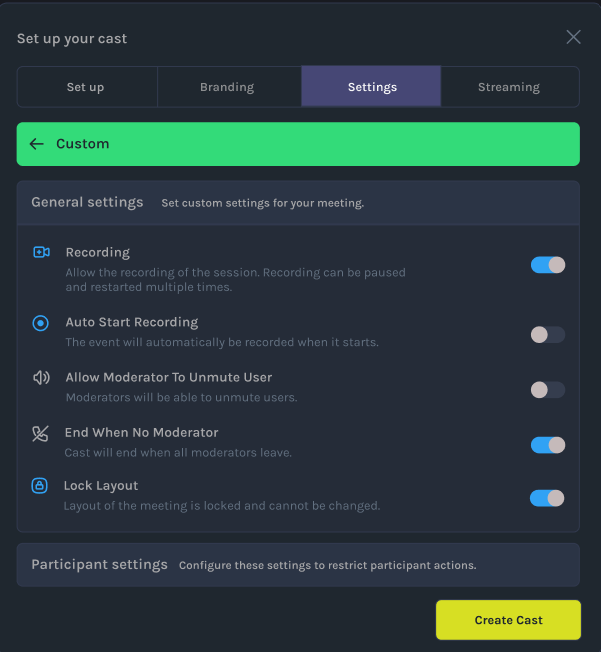
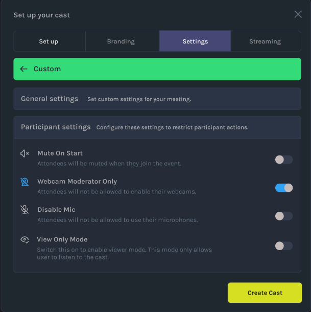
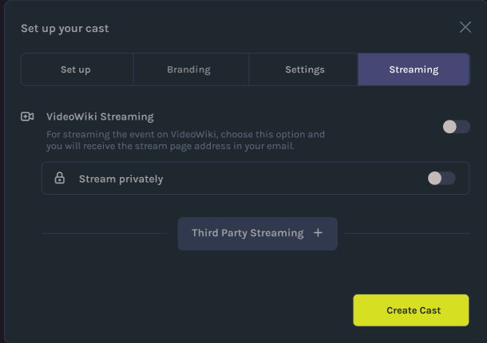
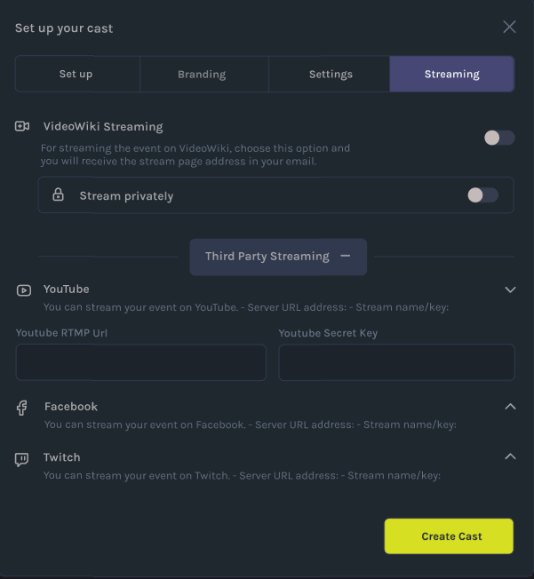
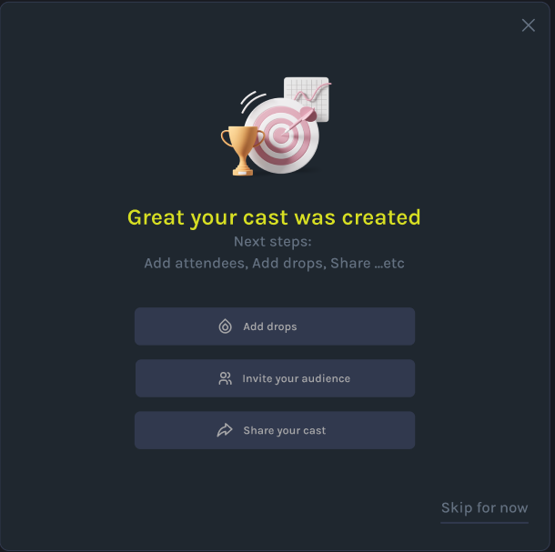

# How to Create a Cast

Ready to bring your ideas to life with Video Wiki? Follow these step-by-step instructions to build your very first Video Wiki Cast.

- When you’re ready to create your first cast, click the "Create Cast" button in the lower left corner of the screen. This will open a popup where you can start building your cast, beginning with the Info section. Here’s a breakdown of each part of the edit cast form.

### 1. Setup Your Cast Details
Initiate your cast creation by clicking "Create Cast" and setting up the essential details. This includes choosing a title, description, and other pertinent information. Visualize the process with the image below:

### 2. Choose Your Branding
Customize the look and feel of your cast by selecting branding options. Click "Create Cast," navigate to the Info section, and choose your branding elements. Here's a guide to help you get started:

#### 2.1 How to Customize Your Cast
Personalize your cast further by learning how to customize various elements. Click "Create Cast," explore the Info section, and discover how to make your cast uniquely yours:

### 3. Choose Your Meeting Type
Tailor your cast to your preferences by selecting the meeting type. Navigate to the Info section, click "Create Cast," and choose the meeting type that suits your needs. Check out the image guide for assistance:

#### 3.1 Know How to Customize Your Meeting (General Settings)
Gain control over your cast by customizing general settings. Click "Create Cast," delve into the Info section, and configure the general settings according to your preferences:

#### 3.2 Know How to Customize Your Meeting (Participant Settings)
Fine-tune participant settings to enhance your cast experience. Click "Create Cast," explore the Info section, and adjust participant settings as needed:

### 4. Stream Your Cast
Take your cast live! Click "Create Cast," proceed to the Info section, and configure streaming options. Explore third-party streaming alternatives for added versatility:

#### 4.1 Check Third-Party Streaming Options
Explore additional streaming options by clicking "Create Cast," navigating to the Info section, and checking out third-party streaming possibilities. Expand your streaming horizons:

### 5. Hurray! You Just Created Your First Cast
Congratulations! You've successfully created your first Video Wiki Cast. Smile for the camera and enjoy the fruits of your cast-building labor:

Get ready to share your ideas with the world through your captivating Video Wiki Cast!
