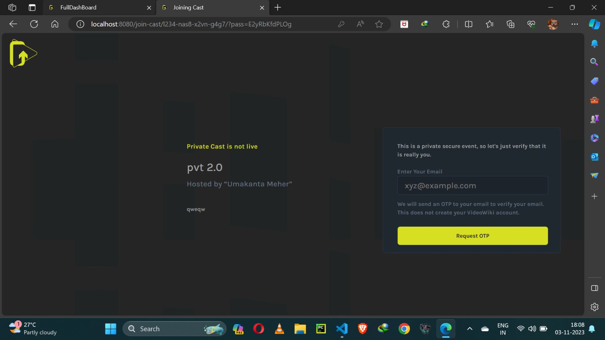
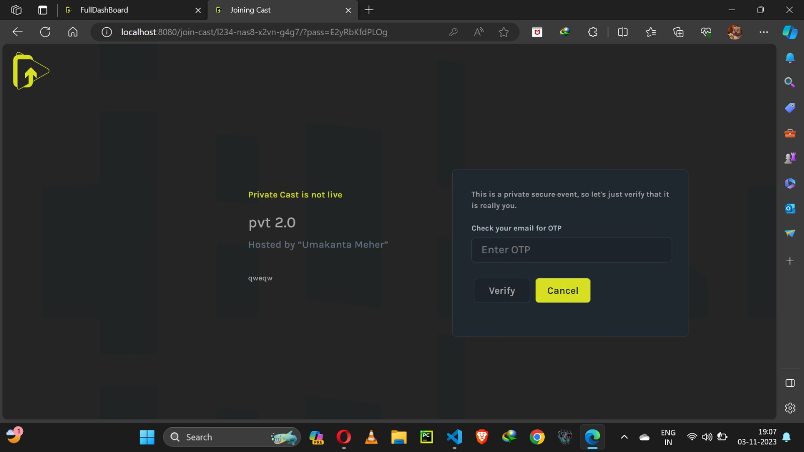
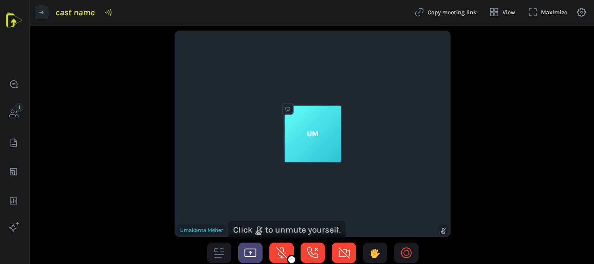

# How to Join a Public/Private Cast
Step-by-step instructions on how to build your first Video Wiki Cast.

-When you’re ready to create your first cast, click the Create Cast button in the lower left corner of the screen. This will open a popup where you can build your cast starting with the Info section. Here’s a breakdown of each part of the edit cast form. 

### 1. JOIN PRIVATE CAST
-When you’re ready to create your first cast, click the Create Cast button in the lower left corner of the screen. This will open a popup where you can build your cast starting with the Info section. Here’s a breakdown of each part of the edit cast form. 

### 2 VERIFY OTP
-When you’re ready to create your first cast, click the Create Cast button in the lower left corner of the screen. This will open a popup where you can build your cast starting with the Info section. Here’s a breakdown of each part of the edit cast form. 

### 3. JOIN PRIVATE CAST
-When you’re ready to create your first cast, click the Create Cast button in the lower left corner of the screen. This will open a popup where you can build your cast starting with the Info section. Here’s a breakdown of each part of the edit cast form. 

### 4 JOIN PUBLIC CAST
-When you’re ready to create your first cast, click the Create Cast button in the lower left corner of the screen. This will open a popup where you can build your cast starting with the Info section. Here’s a breakdown of each part of the edit cast form. 

### 5. CONNECT YOUR VIDEO N AUDIO
-When you’re ready to create your first cast, click the Create Cast button in the lower left corner of the screen. This will open a popup where you can build your cast starting with the Info section. Here’s a breakdown of each part of the edit cast form. 

### 6. HURRAY! YOU JUST JOINED YOUR FIRST CAST
-When you’re ready to create your first cast, click the Create Cast button in the lower left corner of the screen. This will open a popup where you can build your cast starting with the Info section. Here’s a breakdown of each part of the edit cast form. 

