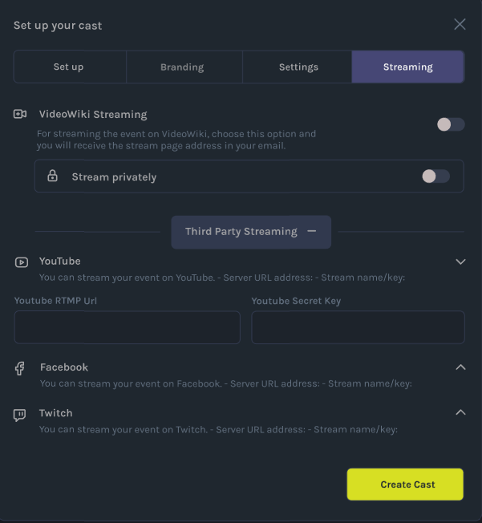
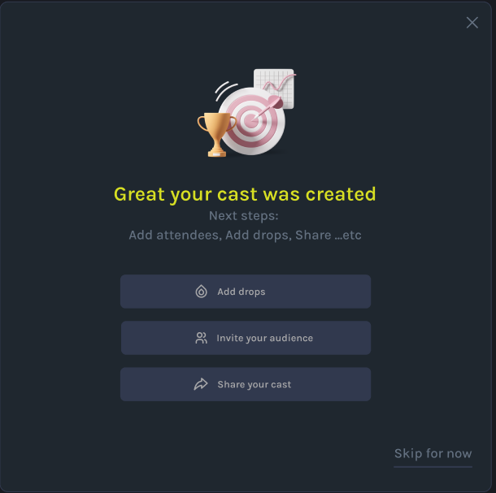

# How to Create an Cast
Step-by-step instructions on how to build your first Video Wiki Cast.

-When you’re ready to create your first cast, click the Create Cast button in the lower left corner of the screen. This will open a popup where you can build your cast starting with the Info section. Here’s a breakdown of each part of the edit cast form. 

### 1. SETUP YOUR CAST DETAILS
-When you’re ready to create your first cast, click the Create Cast button in the lower left corner of the screen. This will open a popup where you can build your cast starting with the Info section. Here’s a breakdown of each part of the edit cast form. 

### 2 CHOOSE YOUR BRANDING 
-When you’re ready to create your first cast, click the Create Cast button in the lower left corner of the screen. This will open a popup where you can build your cast starting with the Info section. Here’s a breakdown of each part of the edit cast form. 

#### 2.1 HOW TO CUSTOMIZE YOUR CAST
-When you’re ready to create your first cast, click the Create Cast button in the lower left corner of the screen. This will open a popup where you can build your cast starting with the Info section. Here’s a breakdown of each part of the edit cast form. 

### 3. CHOOSE YOUR MEETING TYPE
-When you’re ready to create your first cast, click the Create Cast button in the lower left corner of the screen. This will open a popup where you can build your cast starting with the Info section. Here’s a breakdown of each part of the edit cast form. 

#### 3.1 KNOW HOW TO CUSTOMIZE YOUR MEETING (General Settings)
-When you’re ready to create your first cast, click the Create Cast button in the lower left corner of the screen. This will open a popup where you can build your cast starting with the Info section. Here’s a breakdown of each part of the edit cast form. 

#### 3.2 KNOW HOW TO CUSTOMIZE YOUR MEETING (Participant Settings)
-When you’re ready to create your first cast, click the Create Cast button in the lower left corner of the screen. This will open a popup where you can build your cast starting with the Info section. Here’s a breakdown of each part of the edit cast form. 

### 4 STREAM YOUR CAST
-When you’re ready to create your first cast, click the Create Cast button in the lower left corner of the screen. This will open a popup where you can build your cast starting with the Info section. Here’s a breakdown of each part of the edit cast form. 

#### 4.1 CHECK THIRDPARTY STREAMING OPTIONS
-When you’re ready to create your first cast, click the Create Cast button in the lower left corner of the screen. This will open a popup where you can build your cast starting with the Info section. Here’s a breakdown of each part of the edit cast form. 

### 5. HURRAY! YOU JUST CREATED YOUR FIRST CAST
-When you’re ready to create your first cast, click the Create Cast button in the lower left corner of the screen. This will open a popup where you can build your cast starting with the Info section. Here’s a breakdown of each part of the edit cast form. 
