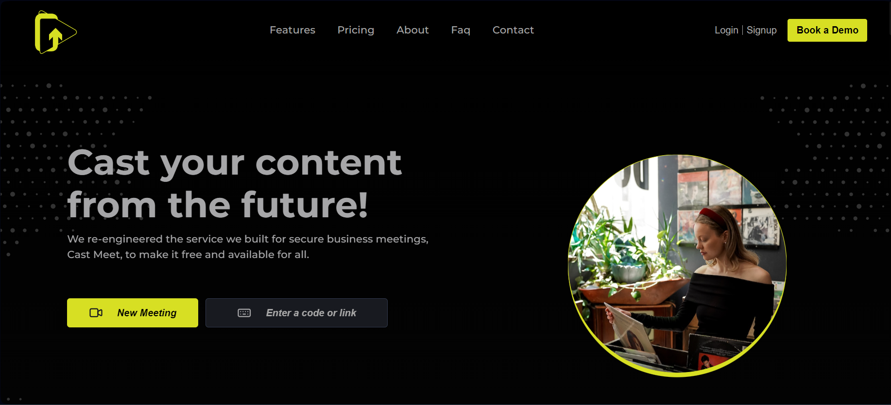
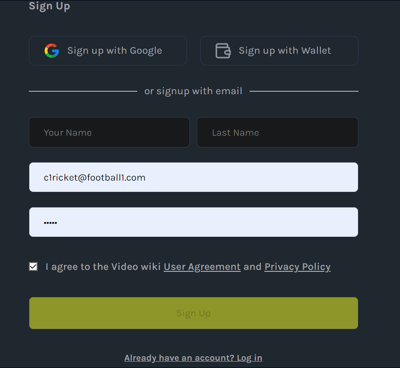
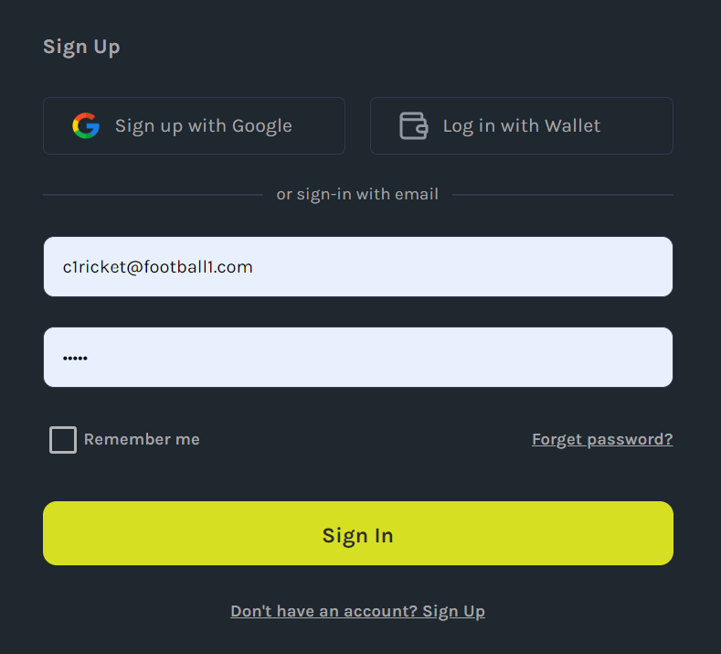
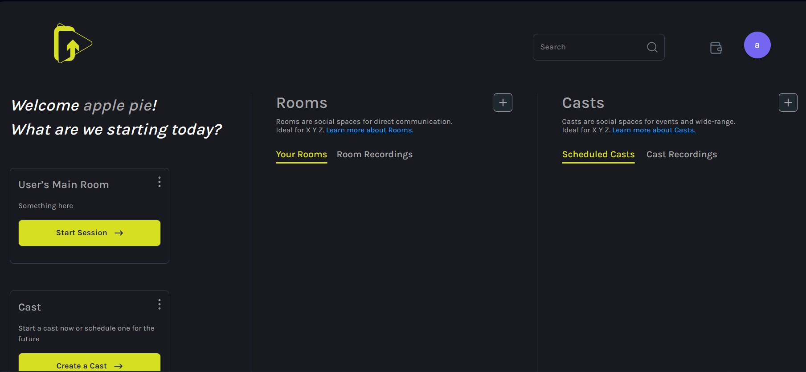

# SIGN-IN/SIGN-UP

Ready to embark on your Video Wiki journey? Follow these step-by-step instructions to create your account and start building your first Video Wiki Cast.

- When you’re ready to create your first cast, click the "Create Cast" button in the lower left corner of the screen. This will open a popup where you can start building your cast, beginning with the Info section. Here’s a breakdown of each part of the edit cast form.

### 1. Click Signup button on the Home Page
To get started, navigate to the home page and click on the "Signup" button. This will initiate the process of creating your Video Wiki account. Visualize the first step with the image below:

### 2. Fill Your Data and Click Signup
After clicking the "Signup" button, fill in your required details in the provided fields. Once your data is entered, click the "Signup" button to proceed. See the guide in the image for a detailed walkthrough:

### 3. Fill Data to Actually Sign In to Your Account
If you already have an account, click the "Sign In" option and fill in the necessary data to access your account. This step ensures a secure sign-in process. Refer to the image guide for assistance:

### 4. Hurray! You Are Sent to Your Dashboard, Create Something
Upon successful signup or signin, celebrate as you are directed to your dashboard. Now you can start creating and managing your Video Wiki Casts. Begin your creative journey with the guidance provided in the image below:

Congratulations on joining Video Wiki! Now, let your creativity shine by building your first cast!
