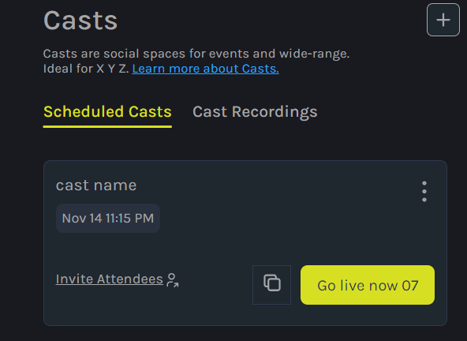
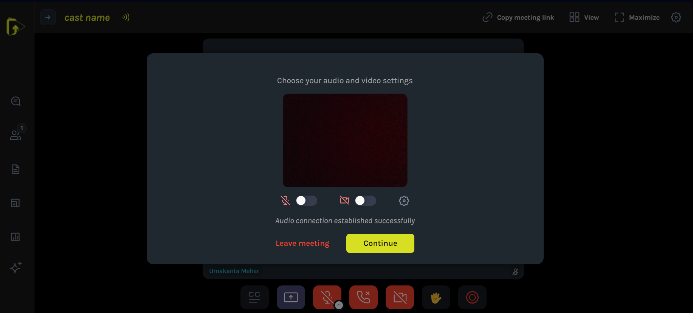
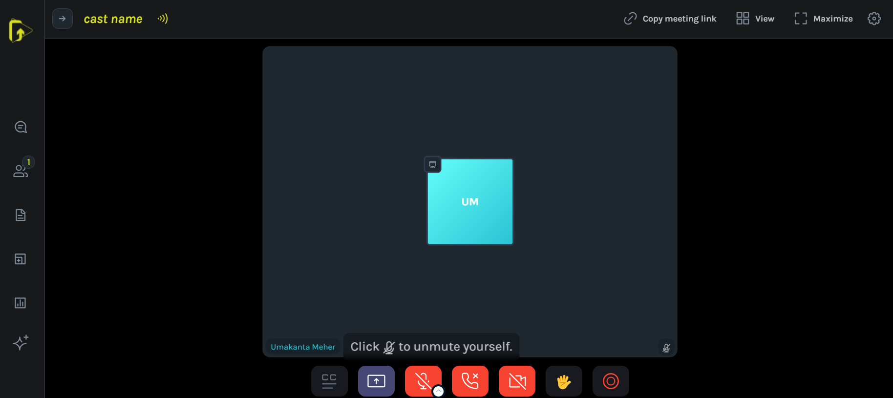

# How to Go Live

Ready to share your content in real-time? Follow these step-by-step instructions to build your first Video Wiki Cast.

- When you’re ready to create your first cast, click the "Create Cast" button in the lower left corner of the screen. This will open a popup where you can start building your cast, beginning with the Info section. Here’s a breakdown of each part of the edit cast form.

### 1. Add Attendees and Click Go Live
Prepare for an engaging live experience! After clicking the "Create Cast" button, you'll be prompted to add attendees and initiate the live session. See the visual guide below:

### 2. Connect Your Audio and Video
Enhance your live cast by ensuring a seamless audio and video connection. When creating your first cast, click the "Create Cast" button, and in the Info section, connect your audio and video to provide a high-quality live experience. Refer to the image for a detailed guide:

### 3. Hurray! Smile, Please! You Are Live
It's showtime! After clicking the "Create Cast" button and navigating through the Info section, smile for the camera – you are officially live! Celebrate the moment and engage with your audience. Here's a snapshot of the joyous occasion:

Get ready to captivate your audience with a dynamic and live Video Wiki experience!
