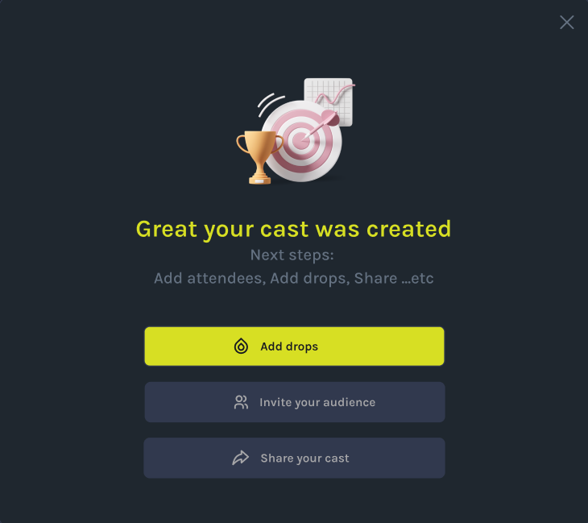

# How to Add NFT drops
Step-by-step instructions on how to add drops

-When you’re create your first cast, click the Add Drop button in the top of the cast created popup on the screen. This will open a popup where you can add drops starting with the Info section. Here’s a breakdown of each part of the edit drops form. 

### 1. CHOOSE DROPS
-Click the Add Drop button which will take you to the Info section 

### 2 ADD DESCRIPTION OF DROPS 
-When you’re ready to create your first cast, click the Create Cast button in the lower left corner of the screen. This will open a popup where you can build your cast starting with the Info section. Here’s a breakdown of each part of the edit cast form. 

### 3. REQUEST OTP
-When you’re ready to create your first cast, click the Create Cast button in the lower left corner of the screen. This will open a popup where you can build your cast starting with the Info section. Here’s a breakdown of each part of the edit cast form. 

### 4. JOIN THE EVENT
-When you’re ready to create your first cast, click the Create Cast button in the lower left corner of the screen. This will open a popup where you can build your cast starting with the Info section. Here’s a breakdown of each part of the edit cast form. 

### 5. OPEN BOX TO GET NFT DETAILS
-When you’re ready to create your first cast, click the Create Cast button in the lower left corner of the screen. This will open a popup where you can build your cast starting with the Info section. Here’s a breakdown of each part of the edit cast form. 

### 6. MINT YOUR NFT
-When you’re ready to create your first cast, click the Create Cast button in the lower left corner of the screen. This will open a popup where you can build your cast starting with the Info section. Here’s a breakdown of each part of the edit cast form. 

### 7. AND ITS DONE! YOU HAVE SUCCESSFULLY MINTED YOUR DROPS
-When you’re ready to create your first cast, click the Create Cast button in the lower left corner of the screen. This will open a popup where you can build your cast starting with the Info section. Here’s a breakdown of each part of the edit cast form. 

